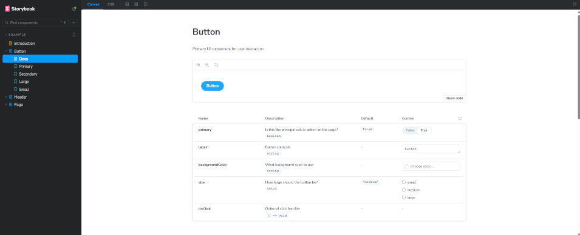
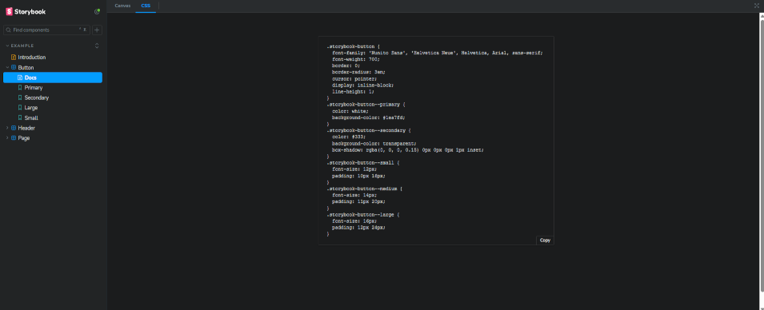

# Storybook Addon - Css Viewer
Display css/less file content linked to story's component in a TAB.

## Project structure

You will find in [/packages](./packages/) folder:
* [css-viewer-addon](./packages/css-viewer-addon/README.md) : The addon itself
* [css-viewer-docs](./packages/css-viewer-docs/README.md) : a demo project to help you understand how it works

## Credentials

 
**Peanuts-83** aka Thomas RANQUE 
https://github.com/Peanuts-83 
tranque@free.fr